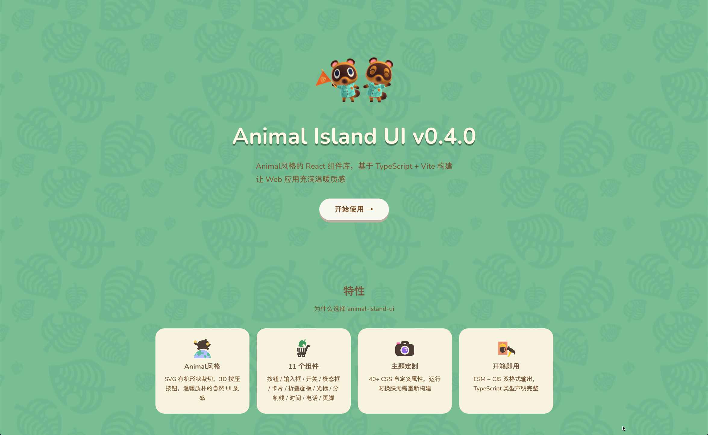

# 🏝 Animal-Island-UI

<div align="center">
        
</div>
<div align="center">
一款参考《治愈系海岛》风格的 React UI 组件库
</div>
<br/>
<div align="center">
    <a href="https://github.com/guokaigdg/animal-island-ui/stargazers"></a>
    <a href="LICENSE"></a>
    <a href="LICENSE"></a>
    <a href="https://github.com/guokaigdg/animal-island-ui/releases"></a>
    <a href="https://gitcode.com/guokaigdg/animal-island-ui"></a>
    <br/>
    <a href="../coverage/badges/coverage.json"></a>
    
    
    
</div>
<br/>
<div align="center">
    <a href="https://trendshift.io/repositories/34594?utm_source=trendshift-badge&amp;utm_medium=badge&amp;utm_campaign=badge-trendshift-34594" target="_blank" rel="noopener noreferrer"></a>
    <a href="https://hellogithub.com/repository/guokaigdg/animal-island-ui" target="_blank"></a>
</div>
<br/>
<p align="center">
    <a href="../README.md">English</a> | 简体中文
</p>

## 介绍

本项目是基于 React + TypeScript 实现的轻量 UI 组件库，采用原创的治愈系海岛风格设计语言，用于个人前端技术练习与组件化开发学习。

所有视觉元素、布局、图标、动画均为本项目从零独立设计实现。

## ⚠️ Git 历史已重写 — 请重新克隆

2026 年 9 月，本仓库的全部 git 历史已重写，以移除侵犯任天堂版权的内容（依据 DMCA 下架通知）。此前所有提交、标签与发行版均已替换为清洁历史。

**如果你在历史重写前克隆或 fork 过本仓库：**

- 请勿 pull 或 merge —— 这会把已移除的内容重新带回你的副本。
- 请删除旧的克隆/fork，然后从本仓库重新克隆或重新 fork。
- 仅接受基于新历史的 Pull Request。

## 预览

- 在线预览 (PC 端) [animal-island-ui-pc](https://guokaigdg.github.io/animal-island-ui/#/)
- 在线预览（移动端）[animal-island-ui-mobile](https://guokaigdg.github.io/animal-island-ui/#/)

## 🚀 用 AI 工具一键生成 animal-island-ui 风格页面（无需写代码）

非研发人员，不想自己写代码？用[一键提示词](./one-click-prompt.md)即可，不需要 npm，不需要打包工具。

**4 步使用：**

1. 复制 [`docs/one-click-prompt.md`](./one-click-prompt.md) 中的提示词代码块。
2. 粘贴到任意可访问 URL 的 AI 工具（Cursor / Claude / ChatGPT / Gemini / v0 / Bolt）发送。
3. AI 会反问做什么页面，用一句话回答即可（如「个人博客」「商品列表」「FAQ」）。
4. 保存 AI 输出的 `index.html`，双击即可预览。

在用 AI 编程 Agent（Claude Code / Codex / Cursor）？直接安装
[animal-island-ui-style skill](../skills/animal-island-ui-style/README.md)：

```bash
skills add guokaigdg/animal-island-ui
```

## 安装

```bash
npm install animal-island-ui
```

## 快速上手

> ⚠️ **重要**: 请务必导入样式文件 `import 'animal-island-ui/style'`，否则组件将没有样式与字体!

```tsx
import { Button, Card } from 'animal-island-ui';
import 'animal-island-ui/style';

function App() {
    return (
        <div>
            <Button type="primary">开始冒险</Button>
            <Card color="app-blue">欢迎来到无人岛！</Card>
        </div>
    );
}
```

## 文档

按读者与场景路由（英文为主文档，中文镜像在 [`docs/zh-CN/`](./zh-CN/)）：

| 文档                                                                           | 用途                                                                                                                          |
| ------------------------------------------------------------------------------ | ----------------------------------------------------------------------------------------------------------------------------- |
| [`docs/design-system/`](./zh-CN/design-system/README.md)                       | 🎨 设计系统严格定义 (single source of truth) —— 设计 token、设计规则、逐组件像素级规范、CSS 变量模板。                        |
| [`skills/animal-island-ui-style/`](../skills/animal-island-ui-style/README.md) | 🤖 可安装的 Agent skill（`skills add guokaigdg/animal-island-ui`）—— React 项目使用 + 单文件 HTML 生成，含分组件 props 参考。 |
| [`docs/one-click-prompt.md`](./zh-CN/one-click-prompt.md)                      | 🚀 给普通用户的一键提示词 —— 粘贴一段引导提示词，AI 自行抓取规范文件并产出可直接双击预览的 `index.html`。                     |
| [`docs/design-prompts.md`](./zh-CN/design-prompts.md)                          | 设计 / 出图工具提示词（v0 / Figma AI / Midjourney / DALL-E），指向规范文件链接。                                              |
| [`docs/development/`](./zh-CN/development/README.md)                           | 本仓库开发文档 —— 目录结构、组件开发、代码规范、测试、构建契约。                                                              |
| [`docs/adr/`](./zh-CN/adr/README.md)                                           | 架构决策记录 (ADR)。                                                                                                          |
| [`AGENTS.md`](../AGENTS.md)                                                    | 在本仓库内工作的 coding agent 入口。                                                                                          |
| [`CONTRIBUTING.md`](../CONTRIBUTING.md)                                        | 贡献指南。                                                                                                                    |

## 本地开发

```bash
# 克隆仓库
git clone https://github.com/guokaigdg/animal-island-ui.git
cd animal-island-ui

# 安装依赖
npm install

# 启动 Demo 开发服务器
npm run dev

# 构建组件库
npm run build

# 构建 Demo 站点
npm run build:demo
```

## 注意事项

- 本项目仅用于个人学习、研究与非商业展示，禁止任何形式的商业使用、二次售卖或盈利行为。
- 不用于任何商业产品、企业项目、对外服务或付费模板。
- 使用本组件库产生的任何风险由使用者自行承担。

## 版权与免责声明

- 本项目为独立创作的开源项目，并非任何游戏公司的官方产品，与任何公司及其产品无关联、授权或合作关系。
- 本仓库内所有视觉素材（图标、插画、动画）均为本项目原创作品。
- 若版权方认为相关内容存在侵权嫌疑，可通过邮箱联系，本人将在第一时间进行整改或删除处理。

## 联系方式

如有问题或版权相关沟通，请通过 Issue 或邮件联系。

## 给小岛续续航

如果这个项目对你有帮助，不妨请开发者的猫吃个罐罐——喵星人才是小岛运转的真正燃料

[赞助小岛](https://guokaigdg.github.io/home/payment.html)

## License

**知识共享 署名-非商业性使用 4.0 国际 (CC BY-NC 4.0)** — 完整文本见 [LICENSE](../LICENSE) 文件。

- **商业使用**：**禁止**。
- **允许的用途（非商业）**：个人学习、研究、评估、测试、非商业展示。
- **需保留署名**：使用本库时必须保留原作者版权声明和协议声明。
- 作者不对因使用本库导致的任何法律问题或损失承担责任。
